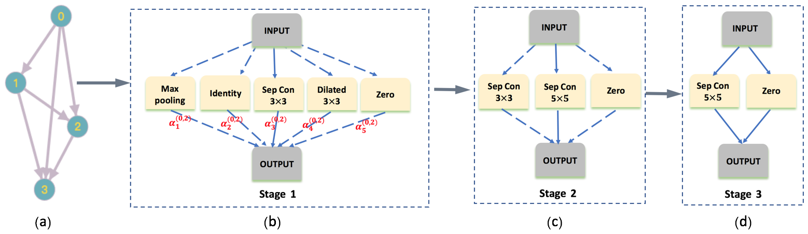
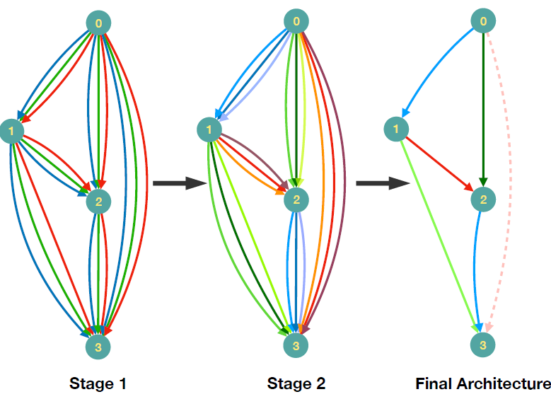
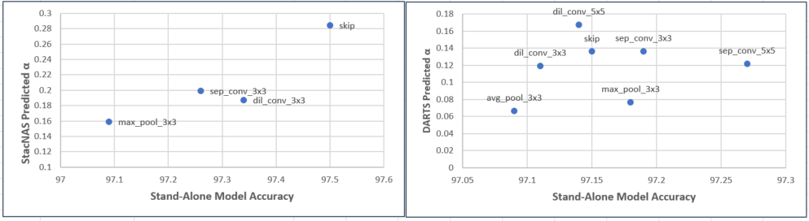
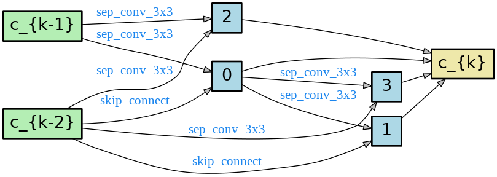
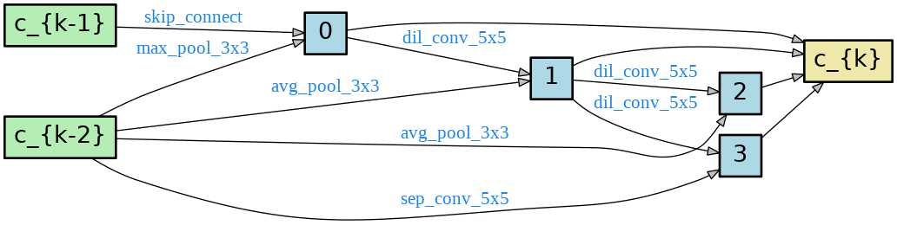
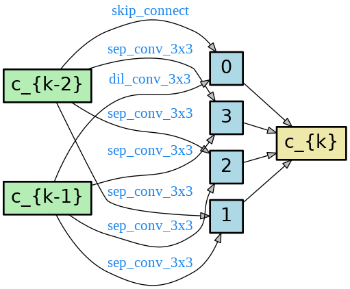
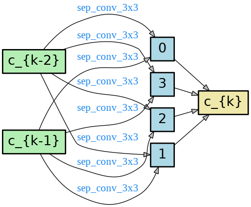

# [StacNAS: Towards Stable and Consistent Optimization for Differentiable Architecture Search](https://openreview.net/forum?id=rygpAnEKDH)


The algorithm proposed a stable and consistent optimization strategy for differentiable architecture search. The mean accuracy is largely improved over DARTS and variance over repeated experiment (withou multiple run and pick the best strategy) is significantly reduced. 

<p align="center">
  
  <br/>Two Stages
</p>
**note: it is optional to keep the search stage operation ZERO in the final architecture, which can serve as an attention to learn the relative contribution of the two paths passing to the same node**


For the experiments on ImageNet, see [this codebase](https://github.com/susan0199/stacnas)ip

<p align="center">
  
  <br/>Two Stages
</p>

## Requirements
```
Python >= 3.5.5, PyTorch >= 1.0.0, torchvision >= 0.2.0
```

## Datasets
CIFAR-10 and CIFAR-100 can be automatically downloaded by torchvision, ImageNet needs to be manually downloaded (preferably to a SSD) following the instructions [here](https://github.com/pytorch/examples/tree/master/imagenet).

## Pretrained models
The easiest way to get started is to evaluate our pretrained StacNAS models.

**CIFAR-10/CIFAR-100** ([cifar10.pth.tar](https://drive.google.com/open?id=1L5OWrK1dzMUIDAesZJhUARFshqEJLdEc)) ([cifar100.pth.tar](https://drive.google.com/open?id=18SmkZouYobRnlqCrEp9tRVb3QlYeiXDZ))
```
python test.py \
    --name job_name \
    --dataset cifar10 \
    --data_dir /path/to/dataset/ \
    --save_dir /path/to/results/ \
    --seed 1 \
    --stage test \
    --batch_size 96 \
    --load_model_dir "models/cifar10.pth.tar"
```
* Expected result: 1.88% test error rate with 4.48M model params.
For CIFAR100, replace  --dataset cifar10  with  --dataset cifar100 
* Expected result: 12.9% test error rate with 4.36M model params.

**IMAGENET(mobile setting)** ([imagenet.pth.tar](https://drive.google.com/open?id=1tV5iHntxbLfG0dF5OmIPMHPw1SythXs6))
* Expected result: 1.88% test error rate with 4.48M model params.

## Architecture search stage1
To carry out architecture search using  
```
python search.py \
    --name job_name \
    --dataset cifar10 \
    --train_ratio 1.0 \
    --data_dir /path/to/dataset/ \
    --save_dir /path/to/results/ \
    --seed 1 \
    --stage search1 \
    --batch_size 64 \
    --init_channels 16 \
    --num_cells 14 \
    --grad_clip 3 \
    --aux_weight 0.0 \
    --epochs 80 \
    --alpha_share
```
Note that train_ratio is the train-valid split ratio, train_ratio=1 means we use all the 50000 training images to search the architecure and use the final result as the best results.

## Architecture search stage2
To carry out architecture search2, run
```
python search.py \
    --name job_name \
    --dataset cifar10 \
    --train_ratio 1.0 \
    --data_dir /path/to/dataset/ \
    --save_dir /path/to/results/ \
    --seed 1 \
    --stage search2 \
    --batch_size 64 \
    --init_channels 16 \
    --num_cells 20 \
    --grad_clip 3 \
    --aux_weight 0.0 \
    --epochs 80 \
    --alpha_share
```
Note that train_ratio is the train-valid split ratio, train_ratio=1 means we use all the 50000 training images to search the architecure and use the final result as the best results.

## Architecture evaluation (using full-sized models)
To evaluate our best cells by training from scratch, run
```
python augment.py \
    --name job_name \
    --dataset cifar10 \
    --train_ratio 1.0 \
    --data_dir /path/to/dataset/ \
    --save_dir /path/to/results/ \
    --seed 3 \
    --stage augment \
    --batch_size 96 \
    --init_channels 36 \
    --num_cells 20 \
    --grad_clip 5 \
    --aux_weight 0.4 \
    --epochs 600 \
    --alpha_share
```
Note that aux_weight=0.4 means add an auxiliary head at the 2/3 position of the network, and add aux_weight * auxiliary_loss to the final loss.

## Feature clustering
To visualizatize feature clustering, run
```
python feature.py \
    --name job_name \
    --dataset cifar10 \
    --data_dir /path/to/dataset/ \
    --save_dir /path/to/results/ \
    --seed 1 \
    --stage search1 \
    --batch_size 64
```
Note that feature.py will load the saved model of search stage1.

## Run all
To run all the above directly, run
```
python run_all.py
```
Note that you should modify the parameters in file run_all.py before running.

## alpha efficiency
<p align="center">
  
  <br/>Two Stages
</p>


## Found architectures

<p align="center">
  
  
  <br/>CIFAR-10
</p>

<p align="center">
  
  
  <br/>CIFAR-100
</p>

<p align="center">
  
  
  <br/>ImageNet
</p>


## Reference
https://github.com/quark0/darts

